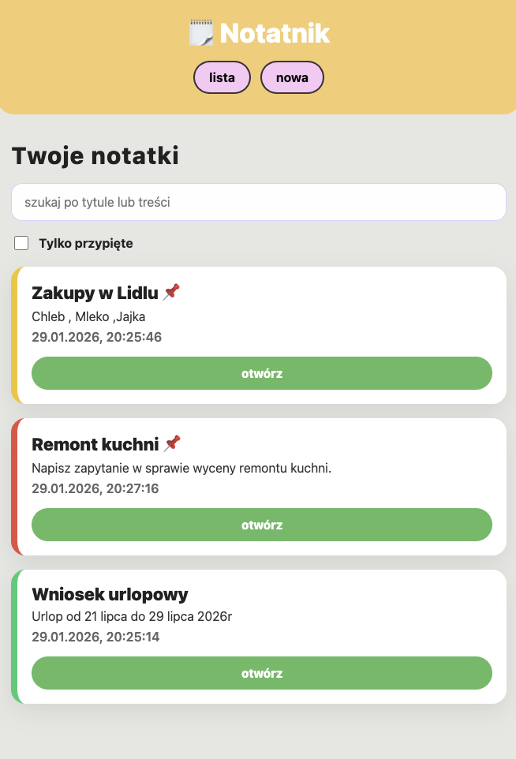

                🗒️ Notatnik offline pwa

                    Opis projektu.

Notatnik to aplikacja webowa typu PWA, która umożliwia tworzenie, edytowanie i przeglądanie notatek.Aplikacja działa offline, może być zainstalowana na telefonie lub komputerze i wykorzystuje natywne funkcje przeglądarki.P

                    Technologie.

HTML,CSS,JavaScript (Vanilla JS),Service Worker,Web App Manifest,localStorage

                    Funkcjonalności.

Dodawanie notatek,edycja notatek,usuwanie notatek,przypinanie notatek,wyszukiwanie notatek,kategorie i kolory notatek,czytanie notatek na głos (Text-to-Speech),udostępnianie notatek (Web Share API),instalacja jako aplikacja (PWA),działanie w trybie offline

                    Widoki aplikacji.

Aplikacja składa się z 3 widoków.
Lista notatek – przeglądanie, filtrowanie i otwieranie notatek
Edytor notatki – dodawanie i edycja notatki
Szczegóły notatki – podgląd, edycja, usuwanie, czytanie na głos

                    PWA – instalacja aplikacji.

Aplikacja posiada plik manifest.webmanifest, dzięki czemu można ją zainstalować na Androidzie , można dodać ją do ekranu głównego ,działa w trybie standalone (jak natywna aplikacja)

                    Tryb offline.

Aplikacja wykorzystuje Service Worker + Cache API.

                    Strategia cache.

Cache on install – pliki aplikacji zapisywane są przy instalacji Service Workera
Network first + fallback – aplikacja próbuje pobrać dane z sieci, a w razie braku połączenia korzysta z cache , Offline page – w przypadku braku zasobów wyświetlana jest strona offline.html

                    Natywne funkcje urządzenia:.

Aplikacja wykorzystuje co najmniej dwie natywne funkcje:
Text-to-Speech (SpeechSynthesis) – czytanie treści notatki na głos
Web Share API – udostępnianie notatek innym aplikacjom
(Dodatkowo wykorzystywane są powiadomienia oraz localStorage)

                    Przechowywanie danych.

Notatki zapisywane są lokalnie w przeglądarce za pomocą localStorage , dane zapisywane są w formacie JSON .Dzięki temu notatki są dostępne po odświeżeniu strony i w trybie offline

                    Zrzuty ekranu widok listy notatek

